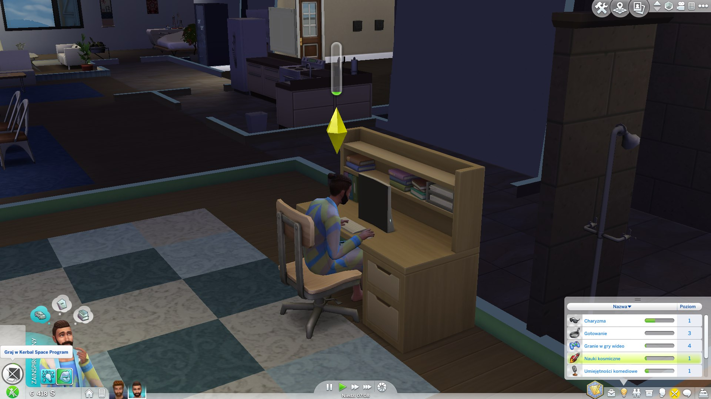

Oops, so I noticed that my last post here was in November and so decided to do a more general dump (and an outline of what's in store in the following months, barring a global uber-crisis leading everyone alive to get back to farming).

I am an engineer now! I defended my thesis on _Quality Assurance in Web and mobile applications_ a little over a month ago. Thus, I am now legally allowed to say "trust me, I'm an engineer". Not much has changed, really, but I'm happy to have done it sooner rather than later.

I celebrated the above-mentioned achievement by taking a week off to just play video games and do nothing productive. Today's actually my first day after that break and I'm happy to say (a) I finally finished Persona 5 after whooping 90 hours (started before the holiday, though, I didn't spend 90 hours just playing one game) and immediately started an NG+ to have a brain cleanser ready whenever I might require it, (b) I fulfilled my long-time dream of creating my own The Sims 4 mod: now it's possible to play Kerbal Space Program in the game and boost your rocket science skill this way:

I've tried really hard to use Windows 10 as my main private-laptop OS and it took me about two weeks to give up on it. Along the way, I've discovered [just how stupid it is](https://support.microsoft.com/en-us/help/982736/0x80070057-error-message-when-you-back-up-files-in-windows-7) (note that this link is for a Windows 7 error, but the same issue applies to Windows 10, it just has a different code I can't seem to be able to locate right now).

Speaking of stupid, I'm doing a Master's degree! It took me a while to decide but eventually I settled for doing it and will, if everything goes well, do my thesis on attacks on computer vision systems (hopefully on both adversarial examples in deep learning and old-school, likes Viola Jones, oriented gradients, etc). I am equally terrified by and excited about the topic.

Finally, speaking of excitement, I switched jobs in October and am now well onto my way to ~world domination~ happiness and professional fulfillment. Also, can't imagine going back to on-site work... I have all the tea I need right there in my kitchen :)

So, what's next on the blog?
1. I've been working on a J2ME (yes) tutorial for a while and will publish it soon.
2. Some other weird tutorials I might be in the mood for.

Cheers!